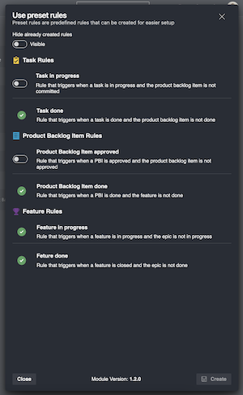

# Preset Rules

Preset rules is a list of suggested rules you can create to get started easier. These rules are based on the default processes, work item and states. If you have custom states or work item types, you will need to configure rules yourself.

## Agile

| Rule Name            | Work item type | Transition State | Parent Type | Parent State |
| -------------------- | -------------- | ---------------- | ----------- | ------------ |
| Task Activated       | Task           | Active           | User Story  | Active       |
| Task Closed          | Task           | Closed           | User Story  | Resolved     |
| User Story Activated | User Story     | Active           | Feature     | Active       |
| User Story Resolved  | User Story     | Resolved         | Feature     | Resolved     |
| User Story Closed    | User Story     | Closed           | Feature     | Closed       |
| Feature Activated    | Feature        | Active           | Epic        | Active       |
| Feature Resolved     | Feature        | Resolved         | Epic        | Resolved     |
| Feature Closed       | Feature        | Closed           | Epic        | Closed       |

## Scrum

| Rule Name                      | Work item type       | Transition State | Parent Type          | Parent State |
| ------------------------------ | -------------------- | ---------------- | -------------------- | ------------ |
| Task In Progress               | Task                 | In Progress      | Product Backlog Item | Committed    |
| Task Done                      | Task                 | Done             | Product Backlog Item | Done         |
| Product Backlog Item Committed | Product Backlog Item | Committed        | Feature              | In Progress  |
| Product Backlog Item Done      | Product Backlog Item | Done             | Feature              | Done         |
| Feature In Progress            | Feature              | In Progress      | Epic                 | In Progress  |
| Feature Done                   | Feature              | Done             | Epic                 | Done         |

## Basic

| Rule Name  | Work item type | Transition State | Parent Type | Parent State |
| ---------- | -------------- | ---------------- | ----------- | ------------ |
| Task Doing | Task           | Doing            | Issue       | Doing        |
| Task Done  | Task           | Done             | Issue       | Done         |
