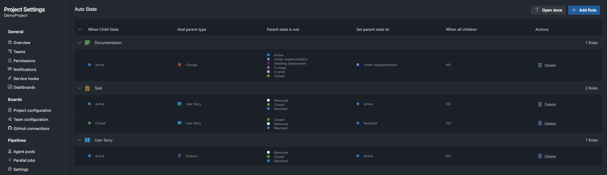

# Auto State

Auto state is an extension to automatically update the state of parent work items based on set rules.

| Field        | Description                                                         |
| ------------ | ------------------------------------------------------------------- |
| workItemType | The type of work item the rule is valid for                         |
| parentType   | The type of work item the parent has to be for the rule to be valid |
| childState   | This is the value the child state is updated to                     |
