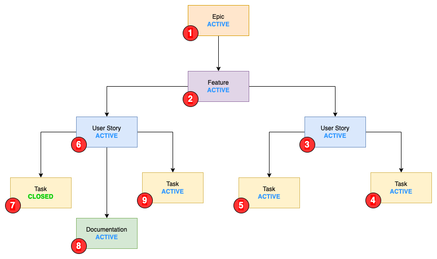
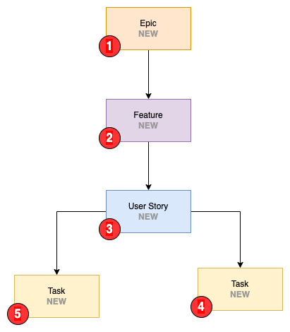

# Rules

The rule system is the core of Auto State. These rules define how states should be updated, and when.

| Field               | Description                                                                                                                      |
| ------------------- | -------------------------------------------------------------------------------------------------------------------------------- |
| Work item type      | This is the work item type for this rule to trigger on                                                                           |
| Parent type         | This is the work item type of the parent relation. E.g the work item type that should be updated.                                |
| Transition state    | The transitioned state for the rule to trigger on (When work item type changes to this) state                                    |
| Parent not in state | Do not trigger the rule if the parent work item is in this state                                                                 |
| Parent target state | This is the state that the parent work item should transition to                                                                 |
| Children lookup     | Take child work items into consideration when processing the rule. See [Children lookup](#children-lookup) for more information. |

## Children lookup

This option is in most case only needed when wanting to set the parents state to something like `Resolved` or `Closed`. When `Children lookup` is turned on, the rule system will take child workitems into consideration when processing work items.

As a general rule:

| Category group | Use `Children lookup` |
| -------------- | --------------------- |
| Proposed       | No                    |
| In Progress    | No                    |
| Resolved       | Yes                   |
| Completed      | Yes                   |
| Removed        | Yes                   |

To better explain this, let us look at the following setup:

### Example One - Closing a user story

Take the following rule:

| Field               | Rule One                        |
| ------------------- | ------------------------------- |
| Work item type      | `Task`                          |
| Parent type         | `User Story`                    |
| Transition state    | `Closed`                        |
| Parent not in state | `Resolved`, `Closed`, `Removed` |
| Parent target state | `Resolved`                      |
| Children lookup     | `False`                         |

When setting `Task (4)` to `Closed`, it will update `User Story (3)` to `Resolved`.

If `Children lookup` was set to `True` for this rule, it would check all other child work items of `User Story (3)` where the target state is the same as the one defined for this rule.

For this scenario it would not change the state of `User Story (3)`, since `Task (5)` does not match the rule condition. If the state of `Task (5)` was `Closed`, it would update the state of `User Story (3)`.

### Example Two - Closing a user story with multiple types as children

Take the following rule:

| Field               | Rule One                        |
| ------------------- | ------------------------------- |
| Work item type      | `Documentation`                 |
| Parent type         | `User Story`                    |
| Transition state    | `Closed`                        |
| Parent not in state | `Resolved`, `Closed`, `Removed` |
| Parent target state | `Closed`                        |
| Children lookup     | `False`                         |

When setting `Documentation (8)` to `Closed`, it will update `User Story (6)` to `Resolved`.

If `Children lookup` was set to `True` for this rule, it would check all other child work items of `User Story (8)` where the target state is the same as the one defined for this rule. Since this parent has two different types of child items (`Documentation` and `Task`) a rule would need to be defined for both of them.

### Example Three - Activating the parent

Take the following rule:

| Field               | Rule One                                  |
| ------------------- | ----------------------------------------- |
| Work item type      | `Task`                                    |
| Parent type         | `User Story`                              |
| Transition state    | `Active`                                  |
| Parent not in state | `Active`, `Resolved`, `Closed`, `Removed` |
| Parent target state | `Active`                                  |
| Children lookup     | `False`                                   |

When setting `Task (5)` to `Active`, it will update `User Story (3)` to `Active`.

Currently recursive updates are not implemented, but the feature is planned [GH#1 Allow recursive update of parents](https://github.com/joachimdalen/azdevops-auto-state/issues/1). This feature would allow for setting `User Story (3)`, `Feature (2)` and `Epic (1)` to `Active` when `Task (5)` to `Active`.

## Process Parents

Setting `Process parents` to `On` will process rules for the parent work item type when finding a rule that matches.

Consider the three following rules:

Rules for `Task`:

| Field               | Rule                                      |
| ------------------- | ----------------------------------------- |
| Work item type      | `Task`                                    |
| Parent type         | `User Story`                              |
| Transition state    | `Active`                                  |
| Parent not in state | `Active`, `Resolved`, `Closed`, `Removed` |
| Parent target state | `Active`                                  |
| Children lookup     | `False`                                   |
| Process parent      | `True`                                    |

Rules for `User Story`:

| Field               | Rule                                      |
| ------------------- | ----------------------------------------- |
| Work item type      | `User Story`                              |
| Parent type         | `Feature`                                 |
| Transition state    | `Active`                                  |
| Parent not in state | `Active`, `Resolved`, `Closed`, `Removed` |
| Parent target state | `Active`                                  |
| Children lookup     | `False`                                   |
| Process parent      | `True`                                    |

Rules for `Feature`:

| Field               | Rule                                      |
| ------------------- | ----------------------------------------- |
| Work item type      | `Feature`                                 |
| Parent type         | `Epic`                                    |
| Transition state    | `Active`                                  |
| Parent not in state | `Active`, `Resolved`, `Closed`, `Removed` |
| Parent target state | `Active`                                  |
| Children lookup     | `False`                                   |
| Process parent      | `False`                                   |

When a `Task` is updated from `New -> Active` this will set the state of the parent `User Story` to `Actice`. Since `Process parent` is turned on here, Auto State will then process rules for `User Story` and so on.

This means that with the rules defined above, and the following as the initial states of the work item hierarchy:

- Task: `New`
- User Story: `New`
- Feature: `New`

We will end up with the following states after `Task` is set to `Actice` and processing is completed:

- Task: `Active`
- User Story: `Active`
- Feature: `Active`
