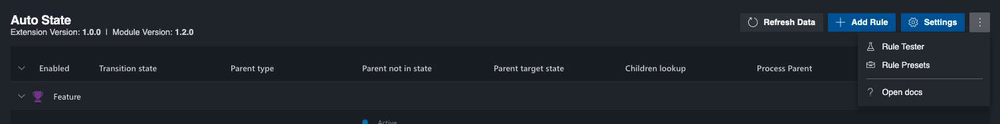
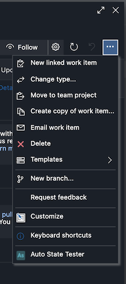
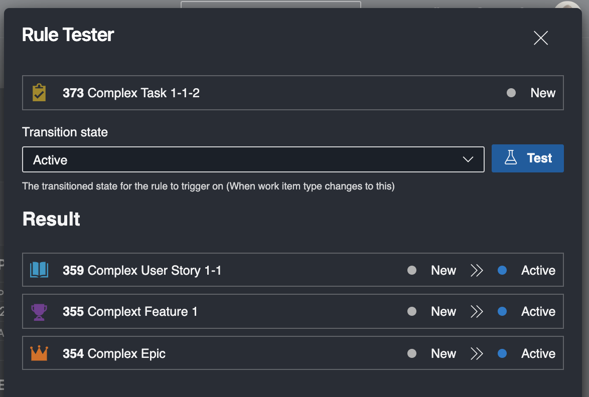

# Auto State Documentation

Welcome to the Auto State documentation.

Auto State is a rule based extension for updating parent states when a work item updated.

- [RULES](./RULES.md)
- [SETTINGS](./SETTINGS.md)

## Rules

For details on how to configure rules, see [RULES](./RULES.md);

## Testing Rules

The Rule Tester allows you to perform a dry run of rules to see how it will update work items.

You can find the rule tester in two places:

1. From the admin page. Here you can test rules for all work items.

   

2. From the individual work item. Here you can test rules for the current work item.

   

The rule tester will show all work items that will be changed.

